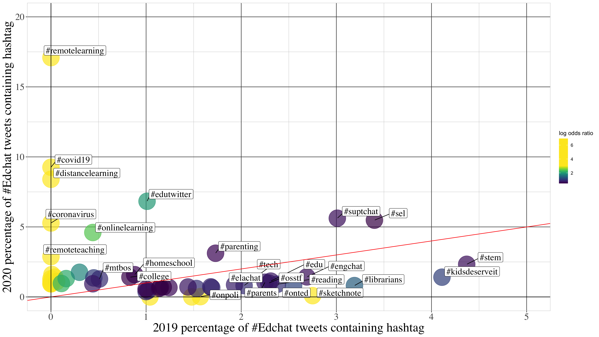
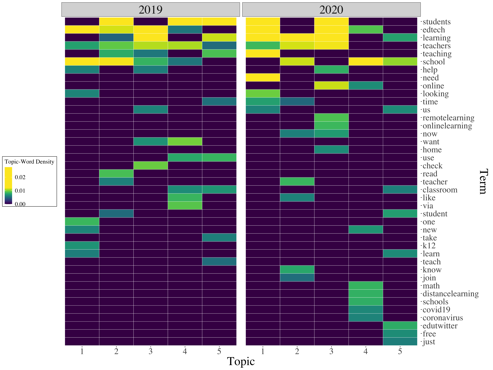

```{r setup, include=FALSE}
usethis::use_git_ignore(c("*.csv", "*.rds"))
options(htmltools.dir.version = FALSE)

library(knitr)
library(tidyverse)
library(xaringan)
```

class: inverse, center, middle

# View Slides

[bretsw.com/aera21-covid-twitter](http://bretsw.com/aera21-covid-twitter)

---

class: inverse, center, middle

# Objective

---

# COVID-19 and Social Media

```{r, out.width = "600px", echo = FALSE, fig.align = "center"}

```

--

Social media use has spiked worldwide during the COVID-19 health crisis as people reach for news, information, and social connections.

---

# Professional Learning Networks

```{r, out.width = "480px", echo = FALSE, fig.align = "center"}

```

Research on PLNs has shown that teachers use social media to connect with others to find resources and supports for teaching (e.g., Trust et al., 2016; Trust & Prestridge, 2021).

---

# Professional Learning Networks

```{r, out.width = "480px", echo = FALSE, fig.align = "center"}

```

**PLNS are:**

--

- Interactive systems of people, spaces, tools, and resources

--

- Flexible and adaptable

--

- *Build-your-own* support system

---

# Teachers on Social Media

```{r, out.width = "560px", echo = FALSE, fig.align = "center"}

```

--

Teachers adapt social media

--

to supplement and expand their PLNs

--

for "just-in-time" learning (Greenhalgh & Koehler, 2017)

---

# Teachers on Twitter

```{r, out.width = "280px", echo = FALSE, fig.align = "center"}

```

--

**Affordances:**

--

- immediate participation

--

- sustained interaction and communication

--

- informal learning

--

- timely reflection

--

- access to mentors

---

# Twitter Hashtags

```{r, out.width = "360px", echo = FALSE, fig.align = "center"}

```

**Hashtags are key to Twitter use:**

--

- Filter and organize information

--

- \#Edchat: one of the longest ongoing educational conversations on Twitter, receiving tens of thousands of tweets monthly. 

---

# Research Questions

```{r, out.width = "480px", echo = FALSE, fig.align = "center"}
include_graphics("img/question.jpg")
```

--

1. To what extent have #Edchat activity levels changed during COVID-19? 

--

2. To what extent have #Edchat topics of conversation been co-opted by COVID-19? 

--

3. What questions are #Edchat participants asking their social network during COVID-19? 

---

class: inverse, center, middle

# Method

---

# Data Collection

```{r, out.width = "540px", echo = FALSE, fig.align = "center"}

```

--

**3 months:** March 1 – May 31

--

**2 years:** 2019 vs. 2020

--

- **332,067** #Edchat tweets in 2019

--

- **257,703** #Edchat tweets in 2020

---

# Data Analysis

```{r, out.width = "480px", echo = FALSE, fig.align = "center"}

```

--

We used R to computationally analyze the data 

--

and we took a random sample of 300 question tweets from 2020 for qualitative content analysis.

---

# Data Analysis

```{r, out.width = "480px", echo = FALSE, fig.align = "center"}

```

**Natural Language Processing:**

--

1. Daily tweet count

--

2. Adjacent hashtags

--

3. Question topics based on qualitative coding of random sample (*n* = 300)

--

  - Follow up: Topic models (using latent Dirichlet allocation)

---

class: inverse, center, middle

# Results

---

# RQ1. Daily Tweets

```{r, out.width = "720px", echo = FALSE, fig.align = "center"}
include_graphics("img/fig1-tweets-over-time-comparison.png")
```

--

Twitter #Edchat activity was lower in spring 2020 than in 2019, a decrease largely accounted for by fewer retweets in 2020.

---

# RQ1. Daily Tweets

```{r, out.width = "720px", echo = FALSE, fig.align = "center"}
include_graphics("img/fig1-tweets-over-time-comparison.png")
```

**Original tweets:** 32.32% of all tweets in 2019 vs. 35.62% in 2020

--

**Question tweets:** 14.52% of original tweets in 2019 contained questions vs. 14.05% in 2020

---

# RQ2. Adjacent Hashtags

```{r, out.width = "720px", echo = FALSE, fig.align = "center"}

```

--

\#Edchat discourse was partially co-opted for COVID-related content. 

---

# RQ2. Adjacent Hashtags

```{r, out.width = "720px", echo = FALSE, fig.align = "center"}

```

The frequency of 25 of the 100 most common #Edchat hashtags increased by 50% or more from 2019 to 2020

---

# RQ2. Adjacent Hashtags

```{r, out.width = "720px", echo = FALSE, fig.align = "center"}

```

Most notably, hashtags directly related to the pandemic (e.g., **#covid19**) and disrupted modes of teaching and learning (e.g., **#remotelearning**). 

--

A quarter of 2020 #Edchat original tweets contained these hashtags.

---

# RQ3. Question Topic Models

```{r, out.width = "720px", echo = FALSE, fig.align = "center"}

```

---

# RQ3. Question Topics (By Hand)

```{r, out.width = "480px", echo = FALSE, fig.align = "center"}
include_graphics("img/interview.jpg")
```

--

In **March-May 2020**, \#Edchat tweeters asked questions related to:

--

- **37%** Exchanging teaching-related advice

--

- **23%** Sharing news, blogs, or articles

--

- **22%** Promoting products

--

- **18%** Socializing

---

# RQ3. Question about Teaching

```{r, out.width = "480px", echo = FALSE, fig.align = "center"}
include_graphics("img/interview.jpg")
```

Teaching-related questions increased from March to May, 2020.

--

These largely connected to COVID-19 (56%) in two main categories:

--

- **Teaching remotely**

> 2 rules for teachers starting online learning: 1. Keep it SIMPLE. 2. Don't reinvent the wheel. What other rules do you feel should be included?

---

# RQ3. Question about Teaching

```{r, out.width = "480px", echo = FALSE, fig.align = "center"}
include_graphics("img/interview.jpg")
```

Teaching-related questions increased from March to May, 2020.

These largely connected to COVID-19 (56%) in two main categories:

- **Teaching with technology**

> Scale of 1 (too easy) -10 (too difficult), how hard is using StoryMaps for high school students? And, how have you used it in your classroom?

---

class: inverse, center, middle

# Significance

---

# PLN Shifts

```{r, out.width = "420px", echo = FALSE, fig.align = "center"}

```

--

These findings illuminate how the pandemic is impacting education professionals.

--

Evidence during the rapid transition to emergency education:

--

- Social media activity levels

--

- Type of information shared 

--

- Questions asked on Twitter  

---

# Just-in-Time PD

```{r, out.width = "480px", echo = FALSE, fig.align = "center"}

```

The shift in the content of #Edchat tweets and questions 

--

toward themes related to remote learning and teaching with technology 

--

reflects a form of flexible, just-in-time professional development 

--

useful to teachers during disrupted times (Greenhalgh & Koehler, 2017). 

---

# Insights for Policy

```{r, out.width = "600px", echo = FALSE, fig.align = "center"}
include_graphics("img/forward.jpg")
```

These insights are valuable for policy makers and educational leaders:

--

- Illuminate educators’ needs

--

- Suggest national educational technology priorities

---

class: inverse, center, middle

# References

---

# References

Greenhalgh, S. P., & Koehler, M. J. (2017). 28 days later: Twitter hashtags as “just in time” teacher professional development. *TechTrends, 61*, 273-281. https://doi.org/10.1007/s11528-016-0142-4

Trust, T., Krutka, D. G., & Carpenter, J. P. (2016). “Together we are better”: Professional learning networks for teachers. *Computers & Education, 102*, 15-34. https://doi.org/10.1016/j.compedu.2016.06.007

Trust, T., & Prestridge, S. (2021). The interplay of five elements of influence on educators’ PLN actions. *Teaching and Teacher Education, 97*, 103195. https://doi.org/10.1016/j.tate.2020.103195

---

# Upcoming Publication

Greenhow, C. M., Staudt Willet, K. B., & Galvin, S. (in press). Inquiring tweets want to know: #Edchat supports for #RemoteTeaching during COVID-19. *British Journal of Educational Technology*. https://doi.org/10.1111/bjet.13097

---

class: inverse, left, top

# Thank you!

```{r, out.width = "600px", echo = FALSE, fig.align = "center"}

```

**Twitter:** [@bretsw](https://twitter.com/bretsw) | [@\_sgalvin\_](https://twitter.com/_sgalvin_) | [@chrisgreenhow](https://twitter.com/chrisgreenhow)

**Slides:** [bretsw.com/aera21-covid-twitter](http://bretsw.com/aera21-covid-twitter)